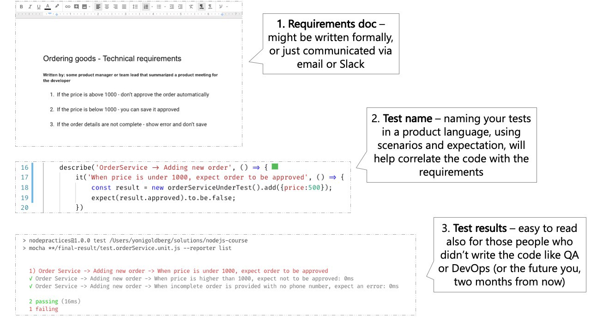

# Включите 3 части в каждое название теста

<br/><br/>

### Объяснение в один абзац

В отчете о тестировании должно быть указано, удовлетворяет ли текущая версия приложения требованиям людей, которые не обязательно знакомы с кодом: тестировщик, инженер DevOps, который развертывает, и будущее, которое вы через два года. Это может быть достигнуто наилучшим образом, если тесты говорят на уровне требований и состоят из 3 частей:

(1) Что тестируется? Например, метод ProductsService.addNewProduct

(2) При каких обстоятельствах и сценарии? Например, в метод не передается цена

(3) Каков ожидаемый результат? Например, новый продукт не утвержден

<br/><br/>

### Пример кода: имя теста, состоящее из 3 частей
```javascript
//1. unit under test
describe('Products Service', () => {
  describe('Add new product', () => {
    //2. scenario and 3. expectation
    it('When no price is specified, then the product status is pending approval', () => {
      const newProduct = new ProductService().add(...);
      expect(newProduct.status).to.equal('pendingApproval');
    });
  });
});
```

<br/><br/>

### Пример кода - Антипаттерн: нужно прочитать весь тестовый код, чтобы понять намерение
```javascript
describe('Products Service', () => {
  describe('Add new product', () => {
    it('Should return the right status', () => {
        //hmm, what is this test checking? what are the scenario and expectation?
      const newProduct = new ProductService().add(...);
      expect(newProduct.status).to.equal('pendingApproval');
    });
  });
});
```

<br/><br/>

### "Как правильно сделать пример: отчет об испытаниях напоминает документ с требованиями"

 [From the blog "30 Node.js testing best practices" by Yoni Goldberg](https://medium.com/@me_37286/yoni-goldberg-javascript-nodejs-testing-best-practices-2b98924c9347)

 

<br/><br/>